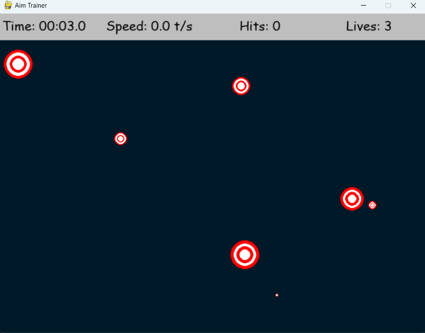

# 🎯 Aim Trainer

## 📌 Overview

Aim Trainer is a highly effective tool developed using **Python** and **Pygame** to help users enhance their aiming precision and reaction time. The game generates random targets that users must click within a time limit while tracking their accuracy and performance metrics.

## 🛠 Features

- 🎯 **Dynamic Target Generation** – Targets appear at random positions to simulate real aiming challenges.
- ⏳ **Real-Time Performance Metrics** – Tracks accuracy, speed, and hits.
- ⚡ **Speed Calculation** – Displays targets clicked per second.
- ❤️ **Lives System** – Players have limited lives before the game ends.
- 🎨 **User-Friendly Interface** – A clean and simple UI with real-time statistics.

## 📜 Requirements

Ensure you have the following dependencies installed before running the project:

```sh
pip install pygame
```

## 🖥️ Installation

Clone the repository and execute the script using Python:

```sh
git clone <repository_url>
cd aim-trainer
python aim_trainer.py
```

## 🎮 How to Play

- 🖱️ Click on the targets as quickly and accurately as possible.
- ❌ Avoid missing targets as you have limited lives.
- 🔄 The game ends when all lives are lost.

## 🔄 Gameplay Flow

1. The game initializes with a blank screen.
2. Random targets begin to appear at set intervals.
3. Click on the targets to hit them before they disappear.
4. Each successful hit improves your score and accuracy.
5. The game ends when the player loses all lives.
6. At the end, performance metrics such as accuracy and speed are displayed.

## 🔧 Troubleshooting

### Common Issues & Solutions

- ❌ **Pygame Not Installed**
  - Run `pip install pygame` to install the required library.
- 🚫 **Game Window Not Opening**
  - Ensure your Python environment is correctly set up and that you are using Python 3.
- ⏳ **Game Running Slowly**
  - Close unnecessary applications to free up system resources.
  - Lower the screen resolution if experiencing lag.
- 🖱️ **Mouse Clicks Not Registering**
  - Try using a different mouse or trackpad.
  - Ensure the game window is active when clicking.

## 📊 Scoring System

- ✅ **Hits** – Number of successfully clicked targets.
- ⚡ **Speed** – Number of targets clicked per second.
- 🎯 **Accuracy** – Percentage of successful clicks.
- ⏳ **Elapsed Time** – Total time spent in the game.

## 📷 Game Interface

<!--  -->

<p align="center"></p>


## 📌 Future Enhancements

- ⏭️ **Difficulty Levels** – Introducing different challenge modes.
- 🏆 **Leaderboard System** – Track high scores and compete with friends.
- 🎵 **Sound Effects & Animations** – Enhance user experience with engaging visuals and sounds.

## 🏗️ Contribution

We welcome contributions! If you have any suggestions or improvements, feel free to open an issue or submit a pull request. 🚀

---

**Happy Aiming!** 🎯🔥

